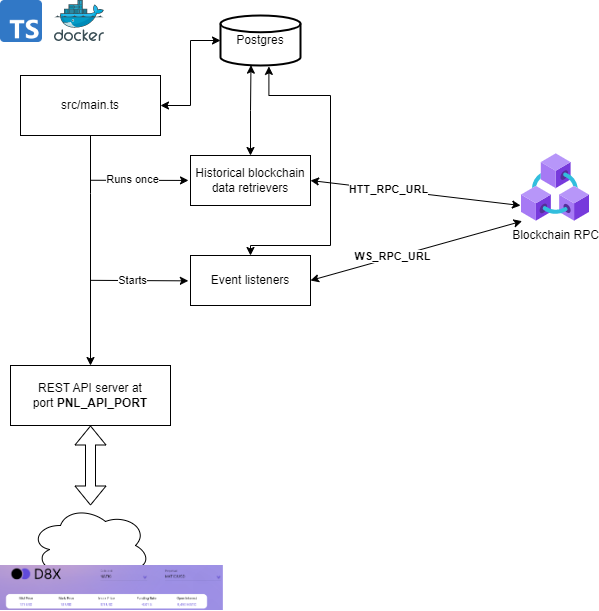

# d8x-trader-backend

The entire backend for the D8X Perpetuals trading frontend package consists of

- this backend code - lerna monorepo consisting of a few services(pnl; api;
  pxws-client) read [here](#services) to find out more about the services.
- candle stick chart server: https://github.com/D8-X/candleD8
- a price server that provides off-chain oracle prices: [D8X fork repo](https://github.com/D8-X/pyth-crosschain-d8x/tree/main/price_service/server)

The services run over http/ws and it is required to install a reverse proxy on
the servers so the traffic can flow via https/wss.

# Docker compose setup

You can spin up all services from this repo + Postgres database via `docker
compose`. Copy the `.envExample` contents to `.env` file and set the values of
`HTTP_RPC_URL` and `WS_RPC_URL` variables to your node http and websockets urls
respectively. Then to start all services simply run:

```bash
docker compose up
```

On the first run this will initialize postgres database in a docker container
with a named volume `pgdb` with credentials and db name specified by
`POSTGRES_USER`, `POSTGRES_PASSWORD`, `POSTGRES_DB` variables from `.env` file.
Make sure to not change these credentials after postgres is initialized,
otherwise you might get authentication errors (or will need to rebuild the
database).

**Note that initially it might take up to a minute to download historical data from
the blockchain**

## Setting up price fetcher cron job

PNL service requires you to set up a price fetcher cron job in order to retrieve
up to date pricing info and store it in database on a daily basis. Please refer to
[PNL Doc](./packages/pnl/README.md#setting-up-the-price-fetcher-cron-job)
on how to set it up.

## Inspecting the database

You can inspect the database via `psql` or any other GUI tool such as DBeaver.
The port (5432 by default) is set and exposed in `docker-compose.yml` file. You
can connect to your `POSTGRES_DB` database with `POSTGRES_USER` and
`POSTGRES_PASSWORD` credentials that you provided in your `.env` file on the
first `docker compose up` run.

```
psql "dbname=db host=hosthere user=user password=password port=5432"
```

# Updating packages with lerna

You can update packages for each subpackage via `lerna exec`. For example to
update to latest `@d8x/perpetuals-sdk` version:

```bash
npx lerna exec -- yarn upgrade @d8x/perpetuals-sdk@latest
```
# Services

Each service has its own README where you can find more documentation about the
functionality of the service. You can find information about API endpoints,
data, setup, etc of each service in its respective README doc.

- [API](./packages/api/README.md) - main backend http and websockets API documentation
- [PNL](./packages/pnl/README.md) - profit and loss, historical trades, APY API documentation
- [PXWS-Client](./packages/pxws-client/README.md) - off-chain index price data streaming

# Architecture

## API & PXWS-Client


## PNL




