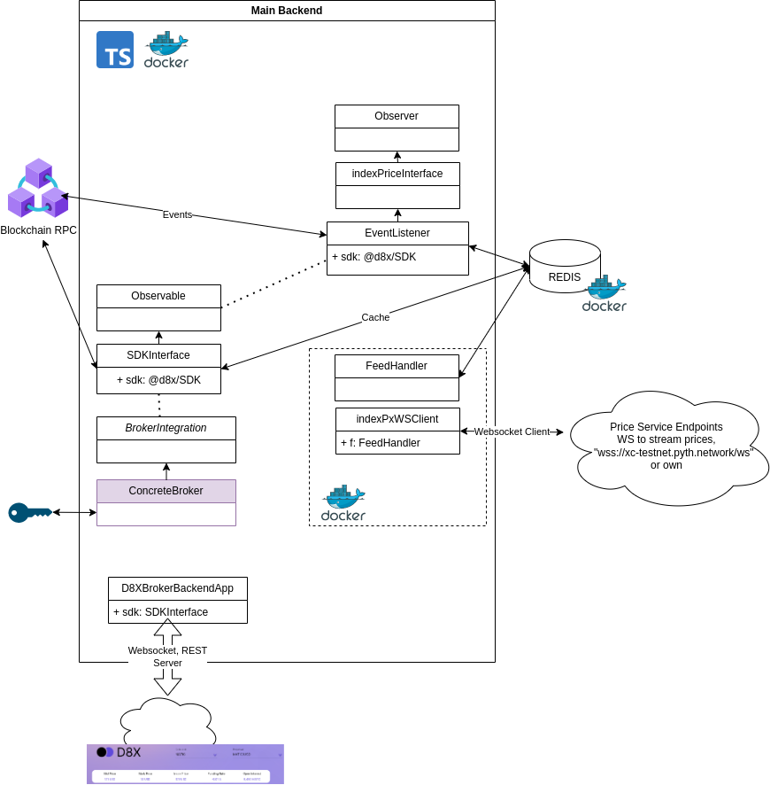

# d8x-trader-backend

The entire backend for the D8X Perpetuals trading frontend package consists of

- this backend code
- candle stick chart server: https://github.com/D8-X/candleD8
- a price server (optional but highly encouraged): https://github.com/pyth-network/pyth-crosschain.git

The services run over http/ws and it is required to install a reverse proxy on the servers so the traffic can flow via https/wss.

# Buidl and run backend

- it is recommended to build your own instance of the Pyth Price service:
  - Repository: https://github.com/pyth-network/pyth-crosschain.git
  - Price service: https://github.com/pyth-network/pyth-crosschain/tree/main/price_service/server
  - Alternatively use the [D8X fork repo](https://github.com/D8-X/pyth-crosschain-d8x/tree/main/price_service/server) (fork not required for backend)

## Prerequisites

Either

- install Redis: https://redis.io/docs/getting-started/installation/install-redis-on-linux/
- node (used v18.14.0 for testing)
- yarn
  Or just Docker.

## Using Docker

- check `wsConfig.json`, especially edit the entry `wsEndpoints` and add your own endpoint, in addition to the public endpoint `wss://xc-testnet.pyth.network/ws`
- Copy `.envExample` file and paste as `.env` file. No changes should be necessary for testnet.
- `cd` into the repository root directory and `docker-compose up --build`

## Without Docker

- Copy `.envExample` file and paste as `.env` file. Make changes if necessary.
  - for example: re-define the ports in `.env`, e.g., 3000 (using 30001 below)
- yarn
- yarn run build
- yarn run start
- REST: http://localhost:3001/
- Websocket: ws://localhost:8080/

## Broker-fee

By default the backend comes without any broker-fee involved. D8X allows brokers to set their
own fee which is added to the exchange fee that the trader is charged. The broker receives the fee
from the D8X smart contracts whenever the trader places a trade.

To apply a broker fee, the broker needs to implement a concrete class that inherits from the
abstract class `BrokerIntegration`. Specifically, the following methods need to be implemented:

1. `getBrokerAddress(traderAddr: string, order?: Order): string`
2. `getBrokerFeeTBps(traderAddr: string, order?: Order): number`
3. `signOrder(SCOrder: SmartContractOrder): string`

By default, a the class `NoBroker` is used. Once the broker implements their own class, the following two lines have to be changed in `index.ts`:

```
import NoBroker from "./noBroker";
...
let d8XBackend = new D8XBrokerBackendApp(new NoBroker(), sdkConfig);
```

Methods (1) and (2) are trivial, method (3) requires access to the broker private key and it can make use of the following code-snippet
that leverages D8X Node SDK:

```
// for a known brokerPrivateKey and brokerAddress
config = PerpetualDataHandler.readSDKConfig("testnet");
let brokerTool = new BrokerTool(config, brokerPrivateKey);
await brokerTool.createProxyInstance();
let signedOrder = await brokerTool.signOrder(order, brokerAddress);

```

# Architecture



## Response Format

```
{ type: "error"| <endpointName> | "connect" | "subscription",
  msg: <endpointName If Error> | "" | <info about connection>,
  data:  "" | <json-object>
}
```

## All GET endpoints (parameter examples):

- `/exchangeInfo` (no parameters): Exchange information, including all pools and perpetuals
- `/perpetualStaticInfo?symbol=ETH-USD-MATIC`: Static data about a perpetual
- `/getPerpetualMidPrice?symbol=MATIC-USD-MATIC`: Current mid-price
- `/getMarkPrice?symbol=MATIC-USD-MATIC`: Current mark-price
- `/getOraclePrice?symbol=ETH-USD`: Latest oracle price
- `/openOrders?traderAddress=0x9d5aaB428e98678d0E645ea4AeBd25f744341a05&symbol=MATIC-USD-MATIC`: All open orders of a trader in a perpetual
- `/positionRisk?traderAddress=0x9d5aaB428e98678d0E645ea4AeBd25f744341a05&symbol=MATIC-USD-MATIC`: Current state of a trader's account in a perpetual
- `/queryFee?traderAddr=0x9d5aaB428e98678d0E645ea4AeBd25f744341a05&poolSymbol=MATIC` : Fee including broker fee in tbps (1e-5)
- `/getOrderIds?traderAddr=0x9d5aaB428e98678d0E645ea4AeBd25f744341a05&symbol=MATIC-USD-MATIC`: Ids of all the orders of a trader in a perpetual
- `/getCurrentTraderVolume?traderAddr=0x9d5aaB428e98678d0E645ea4AeBd25f744341a05&poolSymbol=MATIC-USD-MATIC`: Current trading volume of a trader
- `/addCollateral?symbol=MATIC-USD-MATIC&amount=100`: Data needed to deposit collateral via direct smart contract interaction: perpetual Id, proxy contract address, 'deposit' method ABI, price updates, and HEX-encoded amount
- `/removeCollateral?symbol=MATIC-USD-MATIC&amount=100`: Data needed to withdraw collateral via direct smart contract interaction: perpetual Id, proxy contract address, 'withdraw' method ABI, price updates, and HEX-encoded amount
- `/availableMargin?symbol=MATIC-USD-MATIC&traderAddr=0x9d5aaB428e98678d0E645ea4AeBd25f744341a05`: Maximum amount that can be removed from a trader's account
- `/cancelOrder?symbol=MATIC-USD-MATIC&orderId=0x433cd04c5e9703890d5aa72d90980b90bfde5b087075293abd679a067780629d`: Data needed to cancel a given order via direct smrt contract interaction: order book contract address, 'cancelOrder' method ABI, price updates, and digest to sign by the trader who posted this order

## All POST endpoints for Trader:

If the frontend wants to submit a trade for a trader, it sends the trade-struct
to the `/orderDigest` endpoint using a POST request. The back-end takes care of
the broker fee, signature, and address, and responds with an order-struct that is ready
to be submitted to the contract. The response also contains the contract address of the
order-book that accepts this order. The trader needs to sign the data 'digest' and
then the frontend can submit it.

- `/orderDigest`:
  - parameters `{ orders: [order1, order2], traderAddr: 0x9d5aaB428e98678d0E645ea4AeBd25f744341a05 }`, see test/post.test.ts
  - returns `{digests: ['hash1 which has to be signed', 'hash2 which has to be signed'], ids: ['id 1', 'id 2'], OrderBookAddr: 'address of relevant order book', SCOrders: ['Smart-Contract Order 1',  'Smart-Contract Order 2']}`
  - the trader has to sign the digest, then the frontend must submit the SCOrder:
    `tx = await orderBookContract.postOrder(scOrder, signature)`
  - note that the broker address, signature, and fee, are added to the order in the backend and the returned SCOrder contains this. Optionally this can also work without broker in which case the information is also added.
  - more than one order can be submitted, but they must have the same symbol and correspond to the same trader
  - setAllowance has to be performed on the collateral token and the proxy-contract from the frontend
- `/positionRiskOnTrade`:
  - parameters `{ order: order, traderAddr: 0x9d5aaB428e98678d0E645ea4AeBd25f744341a05 }`, see test/post.test.ts
  - returns `{newPositionRisk: 'MarginAccount type', orderCost: number}`
    - `newPositionRisk` is what the given trader's positionRisk would look like if the given order is executed
    - `orderCost` is the approximate collateral deposit that will be deducted from the trader when the order is executed
- `/positionRiskOnCollateralAction`:
  - parameters `{ traderAddr: 0x9d5aaB428e98678d0E645ea4AeBd25f744341a05, amount: -100, positionRisk: 'Margin account struct' }`, see test/post.test.ts
  - returns `{newPositionRisk: 'MarginAccount type', availableMargin: number}`
    - `newPositionRisk` is what the given trader's positionRisk would look like if the given order is executed
    - `availableMargin` is the maximum amount of margin that can be withdrawn from this account

Swagger (incomplete): http://localhost:3001/api/docs/

# Websocket

The frontend subscribes to perpetuals and trader addresses. Some messages
are trader-address specific, some are broadcasted (indicated below).

- endpoint `ws://localhost:8080`
- subscribe by sending a JSON message in the following format:

```
interface SubscriptionInterface {
  // perpetual symbol, e.g. MATIC-USD-MATIC
  symbol: string;
  // address of the trader
  traderAddr: string;
}
```

response:

```
{ type: "subscription",
  msg: <BTC-USD-MATIC>,
  data: {<perpState>}
}

```

- all messages received are defined in [src/wsTypes](/src/wsTypes) and listed below
- the general format of the messages is

```
{ type: "error"| <endpointName> | "connect",
  msg: <endpointName If Error> | "" | <info about connection>,
  data:  <json-WSMsg-object> | ""
}
```

with `<json-WSMsg-object>` defined as

```
interface WSMsg {
  name: string;
  obj: Object;
}
```

- Objects are built from the following interfaces

```
// broadcasted
// careful: openInterest and fundingRate might
// be zero in which case exchangeInfo should not
// be overwritten with 0.
interface PriceUpdate {
  perpetualId: number;
  midPrice: number;
  markPrice: number;
  indexPrice: number;
  fundingRate: number;
  openInterest: number;
}
```

```
interface LimitOrderCreated {
  perpetualId: number;
  traderAddr: string;
  brokerAddr: string;
  orderId: string;
}
```

```
// broadcasted, so recent trades can be displayed
interface Trade {
  perpetualId: number;
  traderAddr: string;
  // each position has a unique id
  positionId: string;
  // each order has a unique id
  orderId: string;
  // position size in base currency
  newPositionSizeBC: number;
  // execution price in quote currency
  executionPrice: number;
}
```

```
interface PerpetualLimitOrderCancelled {
  perpetualId: number;
  traderAddr: string;
  orderId: string;
}
```

```
interface UpdateMarginAccount {
  perpetualId: number;
  traderAddr: string;
  // id of position
  positionId: string;
  // position size in base currency
  positionBC: number;
  // margin collateral in collateral currency
  cashCC: number;
  // average price * position size
  lockedInValueQC: number;
  // funding payment paid when
  // margin account was changed
  fundingPaymentCC: number;
}
```

## Live index price streams

The components in the folder `indexPXWSClient` serve as a websocket client to the off-chain oracle network and streams index price data
to the frontend.

The `FeedHandler` class gets updated price indices, writes them to REDIS, and publishes the update via
`this.redisPubClient.publish("feedHandler", names);`, where names are colon separated tickers (BTC-USD:BTC-USDC).
To inform the `FeedHandler` what indices are required, the `FeedHandler` subscribes to `"feedRequest"` and
expects indices separated by colons (BTC-USDC:MATIC-USD:ETH-USD) in the message sent when publishing.
The `FeedHandler` requests a `"feedRequest"` message by sending `publish("feedHandler", "query-request")`

The client (SDKInterface) therefore needs to listen to `"feedHandler"` and upon receipt should publish
`"feedRequest"` with the required indices. Requested indices must be available completly via triangulation
from the websocket feeds. Upon receipt of `"feedUpdate"` the eventListener gets the updated
index prices from REDIS and processes them (change of mark-price, mid-price etc.) and streams the relevant
information via Websocket to the frontend.

# GitFlow

check the git flow in the GitFlow.md
