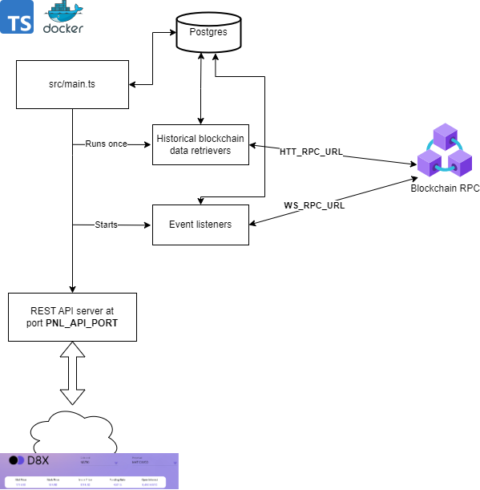

# d8x-trader-backend

The entire backend for the D8X Perpetuals trading frontend package consists of

- this backend code - lerna monorepo consisting of a few services (history; api;
  pxws-client) read [here](#services) to find out more about the services.
- candle stick chart server: https://github.com/D8-X/candleD8
- a price server that provides off-chain oracle prices: [D8X fork repo](https://github.com/D8-X/pyth-crosschain-d8x/tree/main/price_service/server)

The services run over http/ws and it is required to install a reverse proxy on
the servers so the traffic can flow via https/wss.

There must be one backend per chain-id.

# Configuration

## Backend

Parameters for the backend services are found in the `./config` subdirectory at the root level.

- Copy the files in ./config/example.<name>.json into ./config/live.<name>.json (i.e., copy and replace prefix "example." with prefix "live.")
- live.rpc.json: A list of RPC URLs used for interacting with the different chains.
  - You are not required to make changes to this file, but you may add or remove as many RPCs as you need
  - It is encouraged to keep multiple HTTP options for best user experience/robustness
  - At least one Websocket RPC must be defined
- live.wsConfig.json: A list of price IDs and price streaming endpoints
  - You are encouraged to modify this configuration, but the services should be able to start with the default values provided
  - See the main API [readme](./packages/api/README.md) for details
- live.referralSettings.json: Configuration of the referral service

  - See the referral API [readme](./packages/referral/README.md) for details

## Frontend

The Frontend package is tightly linked to these services, and the way it connects with them is configured entirely via environment variables in that project. Once you know on which URLs these API and Websocket services are hosted, they can be connected to the FE by specifying the following environment variables:

- REACT_APP_API_URL: A semicolon separated list of endpoints served by the main REST API service.
  - For example, you could be hosting two main API services, one at `https://api.mybackend.com` for Polygon zkEVM (chain ID 1101) and one at `https://api.test.mybackend.com` for Polygon zkEVM Testnet (chain ID 1442).
  - You must also define a default chain for your frontend, in this example it's Mainnet
  - This entry should then take the form:
    `REACT_APP_API_URL=1101::https://api.mybackend.com;1442::https://api.test.mybackend.com;default::https://api.mybackend.com`
- REACT_APP_HISTORY_URL: A semicolon separated list of endpoints served by the History API service.
  - In line with the example above, you may be hosting the frontend on two different networks, Polyon zkEVM and Polygon zkEVM Testnet as before, using URLS `https://history.mybackend.com` and `https://history.test.mybackend.com`, respectively
  - Then you would define
    `REACT_APP_HISTORY_URL=137::https://history.mybackend.com;1442::https://history.test.mybackend.com;default::https://history.mybackend.com`
- REACT_APP_WEBSOCKET_URL: A semicolon separated list of endpoints served by the price Websocket service.
  - For example, you may be hosting `wss://ws.mybackend.com` for Polygon zkEVM and `wss://ws.test.mybackend.com` for Polygon zkEVM Testnet.
  - Then you would set this variable as
    `REACT_APP_WEBSOCKET_URL=137::wss://ws.mybackend.com/;1442::wss://ws.test.mybackend.com/;default::wss://ws.mybackend.com/`
- REACT_APP_CANDLES_WEBSOCKET_URL: The URL of the candles service, hosted on a different server.
  - This service can be shared by different chains, but it adheres to the same notation as the previous two. If you are hosting this service at `wss://candles.mybackend.com`, then you would set this variable as
    `REACT_APP_CANDLES_WEBSOCKET_URL=default::wss://candles.mybackend.com/`

# Docker compose setup

You can spin up all services from this repo + Postgres database via `docker
compose`. Copy the `.envExample` contents to `.env` file.
Then to start all services simply run:

```bash
docker compose up --build
```

On the first run this will initialize postgres database in a docker container
with a named volume `pgdb` with credentials and db name specified by
`POSTGRES_USER`, `POSTGRES_PASSWORD`, `POSTGRES_DB` variables from `.env` file.
Make sure to not change these credentials after postgres is initialized,
otherwise you might get authentication errors (or will need to rebuild the
database).

**Note that initially it might take up to a minute to download historical data from
the blockchain**

## Inspecting the database

You can inspect the database via `psql` or any other GUI tool such as DBeaver.
The port (5432 by default) is set and exposed in `docker-compose.yml` file. You
can connect to your `POSTGRES_DB` database with `POSTGRES_USER` and
`POSTGRES_PASSWORD` credentials that you provided in your `.env` file on the
first `docker compose up` run.

```
psql "dbname=db host=localhost user=user password=password port=5432"
```

# Development

# Reset database

During the development phase the layout of the database can change. Here is how to reset the database. All data will be lost but
is reconstructed from on-chain events, except for the tables `referral_code` and 'referral_code_usage`.

- run docker compose as detailed above
- `npx prisma migrate reset --schema packages/utils/prisma/schema.prisma`
- restart docker compose

# Updating packages with lerna

You can update packages for each subpackage via `lerna exec`. For example to
update to latest `@d8x/perpetuals-sdk` version:

```bash
npx lerna exec -- yarn upgrade @d8x/perpetuals-sdk@latest
```

# Services

Each service has its own README where you can find more documentation about the
functionality of the service. You can find information about API endpoints,
data, setup, etc of each service in its respective README doc.

- [API](./packages/api/README.md) - main backend http and websockets API documentation
- [HISTORY](./packages/history/README.md) - profit and loss, historical trades, APY API documentation
- [PXWS-Client](./packages/pxws-client/README.md) - off-chain index price data streaming

# Architecture

## API & PXWS-Client


## History


